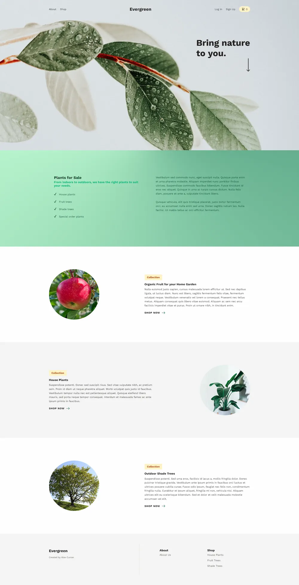
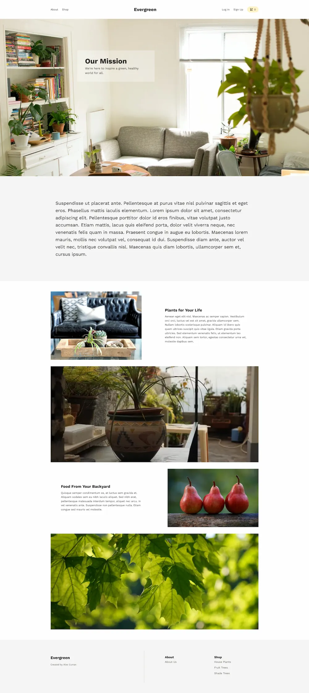
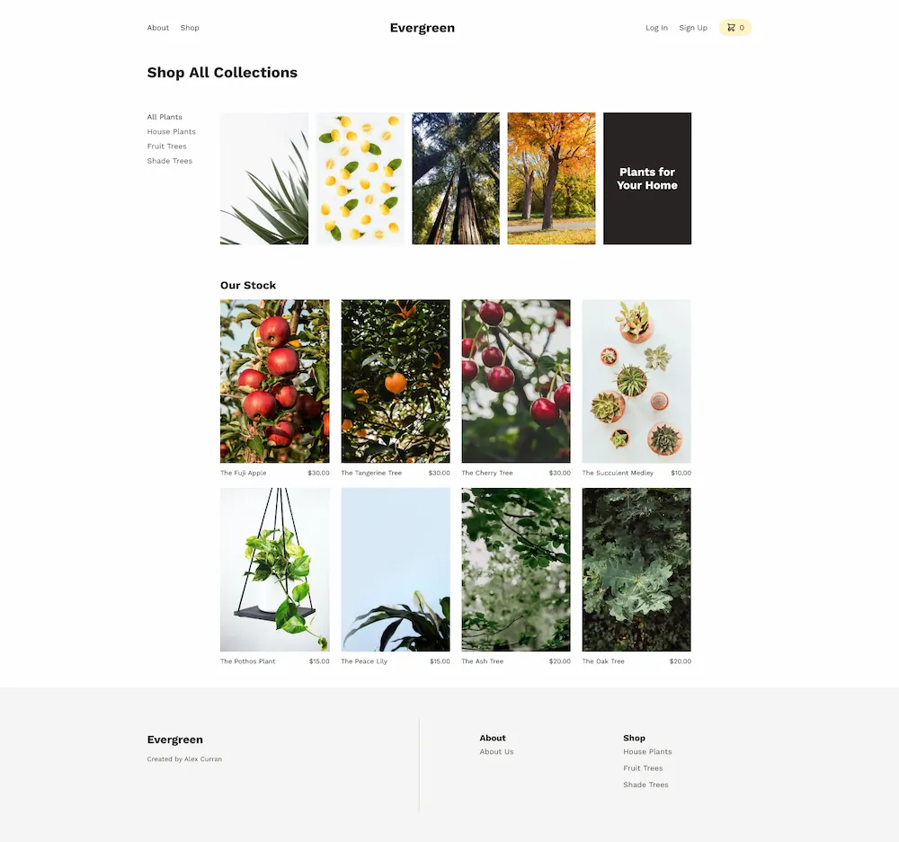
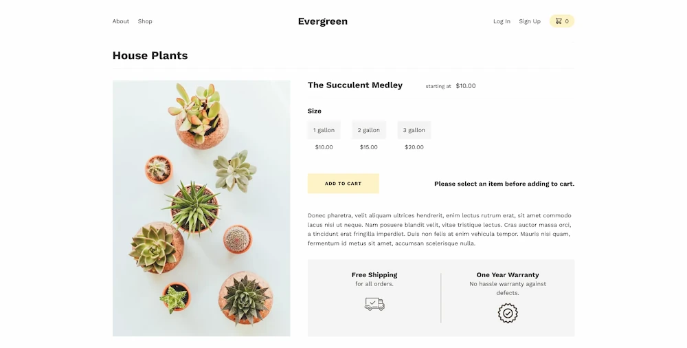
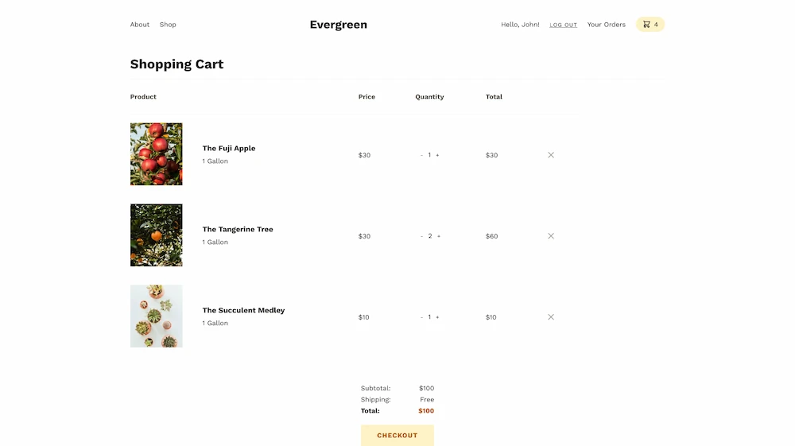
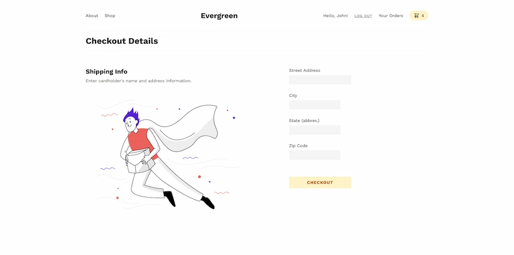

# Evergreen Plant Shop

[Visit Live Site](https://apcurran-evergreen.herokuapp.com/)

## Features:

- Express JS back-end

- React JS front-end (with Hooks API)

- Full authentication functionality with log-in and sign-up

- Admin can add new products, update existing ones, or delete them

- Implemented full cart functionality with increment/decrement, add/remove abilities

- Order history is saved in db, and can be viewed on user order page

- Stripe payments

- PostgreSQL DB with native PG driver

- Zustand store state management

- Password reset implementation with Nodemailer

- All custom CSS layout/styling with modern CSS features (Grid, Flexbox, Custom Properties, etc.)

- Responsive CSS layout accommodating all common screen sizes

- :test_tube: React Testing Library for component unit tests

- :test_tube: Cypress automated testing for integration tests

